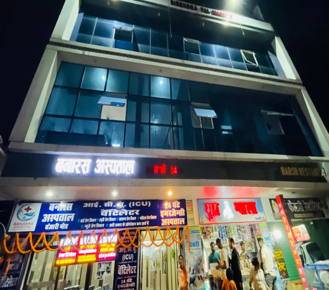
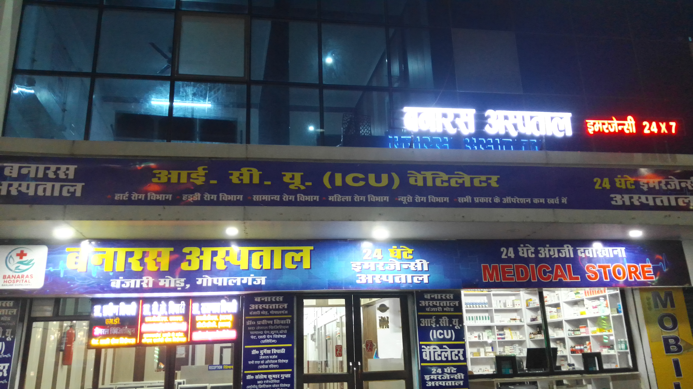
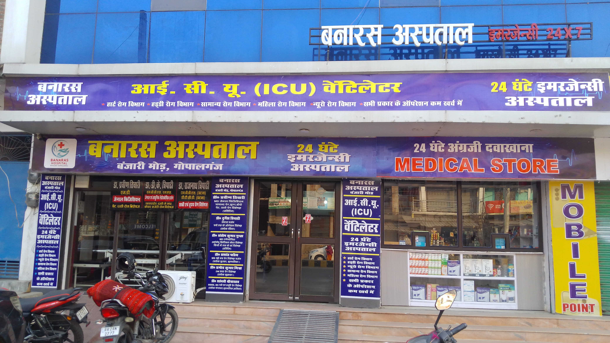

<div align="center">


<br/>

[](https://git.io/typing-svg)

<p>
  
  
  
  
</p>

<p>
  
  
  
  
</p>

<a href="#-features">Features</a> •
<a href="#-preview">Preview</a> •
<a href="#-design-system">Design</a> •
<a href="#-project-structure">Structure</a> •
<a href="#-getting-started">Getting Started</a> •
<a href="#-roadmap">Roadmap</a>

</div>

<br/>


## 🏥 About

**Banaras Hospital** is a multispecialty healthcare center in **Banjari More, Gopalganj, Bihar**, offering `24×7 emergency care`, an advanced **ventilator-equipped ICU**, surgery, cardiology, orthopedics, and diagnostics — the only hospital in the region with this level of critical care support.

This repository holds the hospital's **marketing website**: a fast, static, dependency-light site with an editorial design system, a signature ECG "pulse-line" motif, and scroll-driven micro-animations — no framework, no build tools, just open `index.html` and go.


## ✨ Features

<table>
<tr>
<td width="50%" valign="top">

**🎨 Editorial design system**
Deep teal + warm ivory + amber-gold palette, `Fraunces` serif headlines paired with `Manrope` body text.

**💓 Signature "pulse-line" motif**
An animated ECG trace draws itself in the hero and re-appears as section dividers — tying the visuals to the hospital's cardiology identity.

**🖼️ Photographic section backgrounds**
Real storefront photography with a teal gradient scrim behind every section (except the hero) for a cohesive, magazine-like feel.

**📱 Fully responsive**
Mobile nav, fluid type scale, and touch-friendly tap targets across every breakpoint.

</td>
<td width="50%" valign="top">

**🌀 Scroll-reveal animations**
Lightweight `IntersectionObserver`-powered fade/slide/scale reveals — no animation library required.

**🔢 Animated stat counters**
Years of experience, doctors, and patients count up into view.

**🖱️ Micro-interactions**
Magnetic buttons with a light-sweep hover, glassmorphism sticky nav, hover-lift cards, floating badges.

**🔍 Lightbox gallery**
Click-to-zoom masonry gallery with keyboard navigation (`←` `→` `Esc`).

**♿ Accessible by default**
Respects `prefers-reduced-motion`, semantic HTML, descriptive alt text throughout.

</td>
</tr>
</table>


## 👀 Preview

<div align="center">
<table>
<tr>
<td align="center" width="33%"><br/><sub><b>Hero</b></sub></td>
<td align="center" width="33%"><br/><sub><b>Storefront · Night</b></sub></td>
<td align="center" width="33%"><br/><sub><b>Storefront · Day</b></sub></td>
</tr>
</table>
</div>

> 💡 Clone the repo and open `index.html` in your browser for the full animated experience — static screenshots don't do the scroll-reveal, hover, and pulse-line animations justice.


## 🎨 Design System

<div align="center">

| Deep Teal | Emerald | Amber Gold | Ivory | Ink |
|:---:|:---:|:---:|:---:|:---:|
|  |  |  |  |  |
| `#0F3D3A` | `#1C8C7C` | `#E2A63B` | `#FAF7F1` | `#142420` |
| Nav · Headers | Links · Active | CTAs · Highlights | Page background | Body text |

**Type** — <code>Fraunces</code> (display serif, headlines) + <code>Manrope</code> (body sans, UI)
**Motion** — <code>cubic-bezier(0.16, 1, 0.3, 1)</code> for reveals · <code>IntersectionObserver</code> for scroll triggers

</div>

All design tokens (color, radius, shadow, type, easing) are centralized at the top of [`assets/css/style.css`](assets/css/style.css) under `:root` — change them once to re-theme the entire site.


## 📁 Project Structure

```text
Banaras-Hospital-Website/
├── index.html                  # Home — hero, about, services, doctors, location, contact
├── gallery.html                # Photo gallery — masonry layout + lightbox
├── README.md
└── assets/
    ├── css/
    │   ├── style.css            # 🎨 Design tokens + all styles for index.html
    │   └── gallery.css          # Styles specific to gallery.html
    ├── js/
    │   ├── main.js                # Nav, scroll-reveal, counters, back-to-top, form
    │   └── gallery.js             # Masonry layout + lightbox viewer
    └── images/
        ├── branding/               # Logo / hero / about imagery
        ├── services/                 # Emergency, ICU, Surgery, Cardio, Ortho, Diagnostics
        ├── doctors/                    # Doctor profile photos
        └── gallery/                      # Gallery + section background photography
```


## 🚀 Getting Started

No build tools, no `npm install` — this is a static site.

```bash
# 1. Clone the repository
git clone https://github.com/<your-username>/Banaras-Hospital-Website.git
cd Banaras-Hospital-Website

# 2. Serve it locally (pick one)
npx serve .
# — or —
python3 -m http.server 8000
```

Then open **`http://localhost:8000`** — or just double-click `index.html`.

<details>
<summary><strong>🔧 Common customizations</strong></summary>
<br/>

- **Re-theme the site** → edit the `:root` variables at the top of `assets/css/style.css`
- **Update the appointment form endpoint** → change the `action` attribute on the `<form>` in `index.html` (currently posts to Formspree)
- **Edit doctor info / fees / timings** → plain text inside the `#doctors` section of `index.html`
- **Add gallery photos** → drop images into `assets/images/gallery/` and add a matching `.gallery-item` block in `gallery.html`

</details>


## 🗺️ Roadmap

- [x] Modern editorial redesign with signature pulse-line motif
- [x] Scroll-reveal + micro-interaction animation system
- [x] Photographic section backgrounds
- [x] Gallery lightbox with keyboard navigation
- [ ] Online appointment booking with live doctor availability
- [ ] Patient testimonials section
- [ ] Multi-language support (Hindi / English toggle)
- [ ] Dark mode


## 🤝 Contributing

Contributions, issues, and feature requests are welcome!

1. Fork the project
2. Create your feature branch (`git checkout -b feature/amazing-thing`)
3. Commit your changes (`git commit -m 'Add amazing thing'`)
4. Push to the branch (`git push origin feature/amazing-thing`)
5. Open a Pull Request

## 📄 License

Distributed under the **MIT License**. See `LICENSE` for more information.

<br/>

<div align="center">

**Banaras Hospital** · Banjari More, NH 27, Gopalganj, Bihar - 841428
📞 +91-7545010725 · ✉️ contact@banarashospital.com

<sub>Made with 🩺 and ❤️ for compassionate healthcare</sub>


</div>
